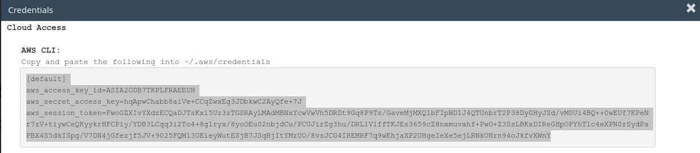
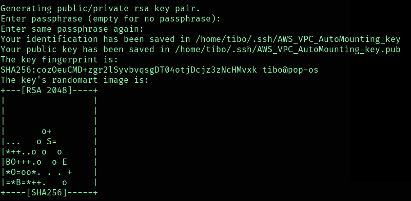
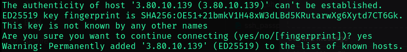

# AWS Automation Project - VPC Deployment with IDS

This project automates the deployment of an Amazon Virtual Private Cloud (VPC) with web and database servers, and an Intrusion Detection System (IDS) to detect SQL injections. The automation is performed through a set of shell scripts and AWS CLI commands. This README provides detailed information on how to set up and use this project.

## Prerequisites

Before using this project, make sure you have the following prerequisites in place:

1. An AWS account with appropriate permissions.
2. AWS CLI installed and configured with the necessary credentials.
3. A working shell environment (Linux, or Windows Subsystem for Linux).
4. AWS Sandbox Lab instance set up.

## Project Structure

The project structure is organized as follows:

```
PROJECT/
│ 
├── cfg/
│   └── config.ini
│ 
├── utils/
│   ├── install_vpc.sh
│   ├── install_webserver.sh
│   ├── install_dbserver.sh
│   ├── install_ids.sh
│   └── configure_ids.sh
│
├── main.sh
├── setup.sh
└── README.md
```

- `setup.sh`: This script sets up necessary permissions and AWS credentials.

- `main.sh`: The main script to initiate the deployment of the VPC and IDS.

- `cfg/config.ini`: Configuration file to store environment-specific variables.

- `utils/install_vpc.sh`: Script for creating the VPC and configuring network resources.

- `utils/install_webserver.sh`: Script for deploying the web server.

- `utils/install_dbserver.sh`: Script for deploying the database server.

- `utils/install_ids.sh`: Script for deploying the IDS.

- `utils/configure_ids.sh`: Script for configuring the IDS.

## Getting Started

Follow these steps to get started with the project:

1. Start an AWS Sandbox Lab instance and make sure you have the AWS CLI credentials for that instance.

   

2. Set execution rights and run the `setup.sh` script to configure AWS CLI credentials. This script will remove existing SSH keys and credentials, and set up new ones. 

   ```
   chmod +x setup.sh
   ./setup.sh
   ```

   You will be able to paste the new AWS CLI credentials:
   

3. Execute the `main.sh` script to start the VPC deployment and IDS installation:

   ```
   ./main.sh
   ```

4. The `main.sh` script will internally call the following scripts in order:
   - `utils/install_vpc.sh`
   - `utils/install_webserver.sh`
   - `utils/install_dbserver.sh`
   - `utils/install_ids.sh`
   - `utils/configure_ids.sh`   


## Configuration

You can customize the deployment by editing the `cfg/config.ini` file. 
This file stores environment-specific configuration variables that can be adjusted to fit your needs.

## Usage Tips and Common Prompts

During the deployment process, you may encounter certain prompts and confirmations. Here are some tips on handling these situations:

### Generating SSH Key Pair

When generating the SSH key pair, the script will ask for a passphrase:


It's recommended to leave this field empty by just pressing `Enter`. 
This ensures that the SSH key won't ask for password confirmation later in the process.

### Confirming Connections

At various stages of the deployment, the script may ask you to confirm the connection to a remote server.


To do so, simply type "yes" (without quotes) and press `Enter` to continue.

### Restarting Services

After packages are installed and servers are upgraded, you may be prompted several times to restart certain services. 


To handle these prompts efficiently, confirm every operations by pressing `Enter`.

### Configuring IDS (Snort)

#### IDS directly installed on Web Server
Once that the IDS is installed, the script may ask you to set an adress range for the local network.


You will have to set the adress range to the value of the public subnet CIDR (by default `10.0.1.0/24` in the `cfg/config.ini` file) 

#### IDS Traffic Mirroring

Nothing for the moment...