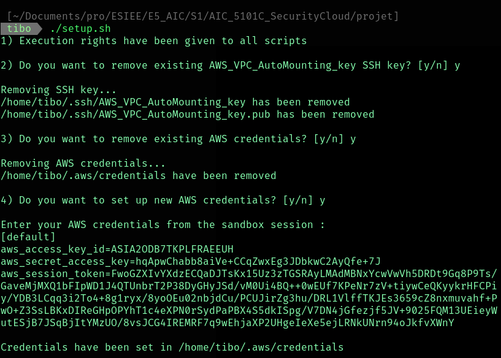
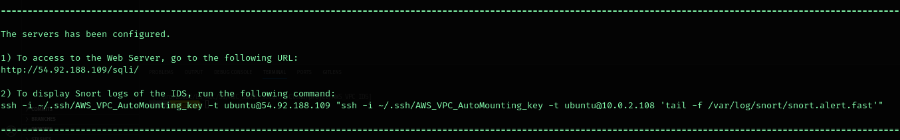
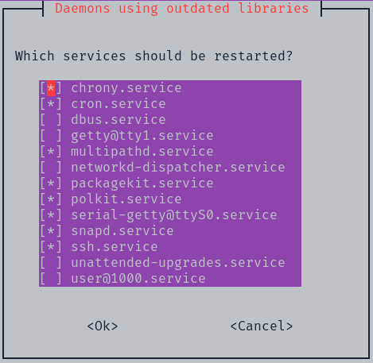

# AWS Automation Project - VPC Deployment with IDS

This project automates the deployment of an Amazon Virtual Private Cloud (VPC) with web and database servers, and an Intrusion Detection System (IDS) with Trafic Mirroring to detect SQL injections. The automation is performed through a set of shell scripts and AWS CLI commands. This README provides detailed information on how to set up and use this project.

This project was created as part of ESIEE's AI & Security Cloud Services course. It served as a practical assignment for the course and demonstrates the skills and knowledge gained during the learning process.

- **School:** ESIEE Paris
- **Course:** AIC 5101C - AI & Security Cloud Services
- **Instructor:** OMAR Mawloud
- **Authors:** 
   - BOIS Sébastien
   - BOUET Maxime
   - RENOU Thibault
   - TAHRAT Yanis

## Prerequisites

Before using this project, make sure you have the following prerequisites in place:

1. An AWS account with appropriate permissions.
2. AWS CLI installed and configured with the necessary credentials.
3. A working shell environment (Linux, or Windows Subsystem for Linux).
4. AWS Sandbox Lab instance set up.

## Project Structure

The project structure is organized as follows:

```
PROJECT/
│ 
├── cfg/
│   └── config.ini
│ 
├── utils/
│   ├── install_vpc.sh
│   ├── install_ids.sh
│   ├── configure_webserver.sh
│   ├── configure_dbserver.sh
│   └── configure_ids.sh
│
├── images/
│
├── main.sh
├── setup.sh
├── project.pdf
└── README.md
```

- `cfg/config.ini`: Configuration file to store environment-specific variables.

- `setup.sh`: The script to set up necessary permissions and AWS credentials.

- `main.sh`: The main script to initiate the deployment of the VPC and IDS.

- `utils/install_vpc.sh`: Script for deploying the VPC and configuring network resources.

- `utils/install_ids.sh`: Script for deploying the IDS and configuring the traffic mirroring

- `utils/configure_webserver.sh`: Script for configuring the web server.

- `utils/configure_dbserver.sh`: Script for configuring the database server.

- `utils/configure_ids.sh`: Script for configuring the IDS.

## Getting Started

Follow these steps to get started with the project.
To see how the project can be run, follows the instructions or watch the video [here](video_link).

#### 1. Clone the repository

   ```shell
   git clone https://github.com/tibo-91/AWS_VPC_IDS.git
   cd AWS_VPC_IDS/
   ```

#### 2. Start an AWS Sandbox Lab

   Launch an AWS Sandbox instance and make sure you can access the AWS CLI credentials for that instance.

   

#### 3. Run the `setup.sh` script

   Set execution rights and run the `setup.sh` script to configure AWS CLI credentials. This script will give execution rights, remove existing SSH keys and credentials, and set up new ones. 

   ```shell
   chmod +x setup.sh
   ./setup.sh
   ```

   You will be able to paste the new AWS CLI credentials:

   

#### 4. Run the `main.sh` script

   Execute the `main.sh` script to start the VPC deployment and IDS installation.

   ```shell
   ./main.sh
   ```
   The `main.sh` script will internally call the following scripts in order:
   - `utils/install_vpc.sh`
   - `utils/configure_webserver.sh`
   - `utils/configure_dbserver.sh`
   - `utils/install_ids.sh`
   - `utils/configure_ids.sh`   

#### 5. Test the IDS

   Once the `main.sh` has finished running, you can go on the website and test the IDS by performing SQL injections.
   To do so, you can follow the given indications by the output:

   

   You can click on the URL to go on the website, and you will have to setup the database for the lab as it follows:

   
   

   Then you can perform SQL injections on the differents labs, and verify that the IDS is working well by running the second command:

   

## Configuration

You can customize the deployment by editing the `cfg/config.ini` file. 
This file stores environment-specific configuration variables that can be adjusted to fit your needs.

## Usage Tips and Common Prompts

During the deployment process, you may encounter certain prompts and confirmations. Here are some tips on handling these situations:

### Generating SSH Key Pair

When generating the SSH key pair, the script will ask for a passphrase:


It's recommended to leave this field empty by just pressing `Enter`. 
This ensures that the SSH key won't ask for password confirmation later in the process.

### Confirming Connections

At various stages of the deployment, the script may ask you to confirm the connection to a remote server.


To do so, simply type "yes" (without quotes) and press `Enter` to continue.

### Restarting Services

After packages are installed and servers are upgraded, you may be prompted several times to restart certain services. 



To handle these prompts efficiently, confirm every operations by pressing `Enter`.

### Configuring IDS (Snort)

You can choose between installing the IDS directly on the Web Server, or implementing Traffic Mirroring, by modifying the value of variable `$traffic_mirroring` in the `cfg/config.ini` file. It is important to note that IDS configuration varies according to the chosen method.

#### IDS with Traffic Mirroring

Once that the IDS is installed, the script may ask you to set an adress range for the local network.


You will have to set the adress range to the value of the private subnet CIDR (by default `10.0.2.0/24` in the `cfg/config.ini` file) 

#### IDS directly installed on Web Server (traffic mirroring disabled)

Once that the IDS is installed, the script may ask you to set an adress range for the local network.


You will have to set the adress range to the value of the public subnet CIDR (by default `10.0.1.0/24` in the `cfg/config.ini` file) 